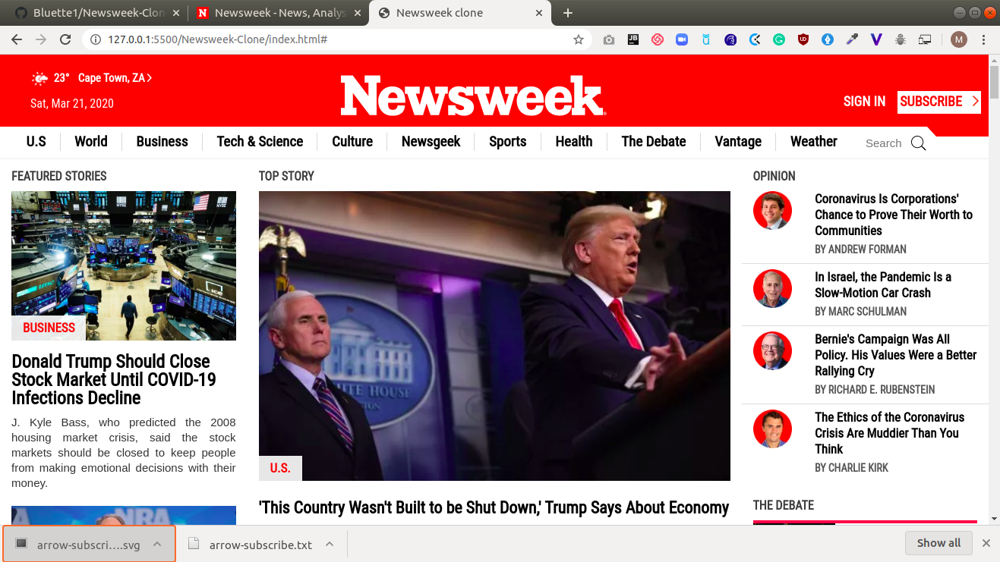

# Newsweek-Clone

This is the seventh project of the Main HTML/CSS curriculum at [Microverse](https:www.microverse.org/) - @microverseinc.

# Newsweek-Clone ([The Odin Project](https://www.theodinproject.com/courses/html5-and-css3/lessons/using-bootstrap)

## Built With

- HTML5 
- CSS3
- Bootstrap v4.4.1 

## Description

The task was to clone the [original page](https://www.newsweek.com/).

This project is mainly about

-  CSS Frameworks in Web Design.

This web page is built using the [Bootstrap](https://getbootstrap.com/docs/4.4/getting-started/introduction/) framework.

## Live Demo

[Live Demo](https://rawcdn.githack.com/Bluette1/Newsweek-Clone/6cbabb0d5043d7f82a28caa192062ef850fbd589/index.html)

## Authors

👤 **Marylene Sawyer**
- Github: [@Bluette1](https://github.com/Bluette1)
- Twitter: [@MaryleneSawyer](https://twitter.com/MaryleneSawyer)
- Linkedin: [Marylene Sawyer](https://www.linkedin.com/in/marylene-sawyer-b4ba1295/)

## 📝 License

This project is [MIT](https://opensource.org/licenses/MIT) licensed.